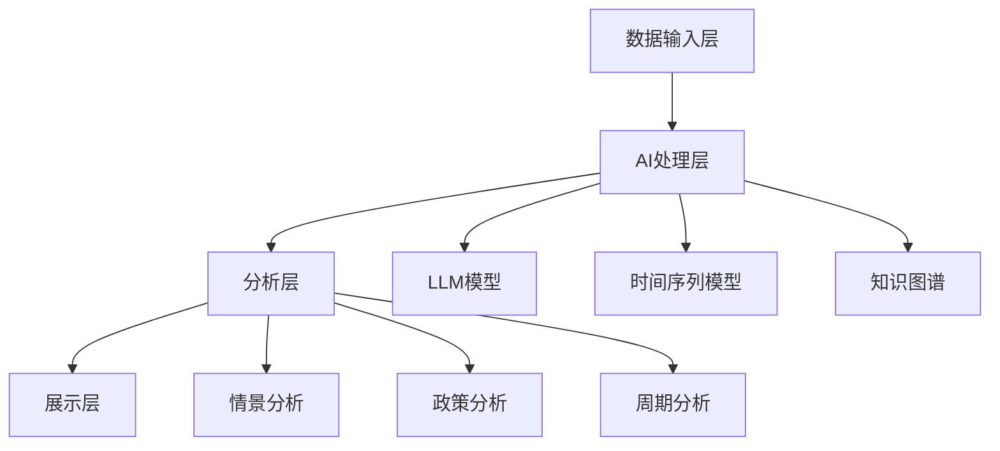

# 宏观经济分析高级工具实现文档

## 目录
- [1. 情景分析模拟器](#1-情景分析模拟器)
- [2. 政策影响评估工具](#2-政策影响评估工具)
- [3. 经济周期分析仪表盘](#3-经济周期分析仪表盘)
- [4. AI集成方案](#4-ai集成方案)
- [5. 实施路线](#5-实施路线)

## 1. 情景分析模拟器

### 1.1 核心功能设计

#### 组件结构
```vue
<!-- src/views/ScenarioSimulator.vue -->
<template>
  <div class="scenario-simulator">
    <div class="flex flex-col h-screen">
      <!-- 顶部控制面板 -->
      <div class="flex-none p-4 bg-white shadow">
        <ScenarioControls 
          @create-scenario="handleScenarioCreate"
          @reset="resetSimulation"
        />
      </div>
      
      <!-- 主要内容区域 -->
      <div class="flex-1 flex overflow-hidden">
        <!-- 左侧参数面板 -->
        <div class="w-1/3 bg-white p-4 overflow-y-auto">
          <ParameterPanel 
            :parameters="parameters"
            @parameter-change="handleParameterChange"
          />
        </div>
        
        <!-- 右侧结果展示 -->
        <div class="flex-1 p-4 overflow-y-auto">
          <SimulationResults 
            :results="simulationResults"
            :loading="isSimulating"
          />
        </div>
      </div>
    </div>
  </div>
</template>
```

#### AI集成接口
```typescript
// src/services/ai/scenarioAnalysis.ts
interface ScenarioService {
  // 情景生成
  generateScenarios(params: {
    baselineData: TimeSeriesData;
    constraints: ParameterConstraints;
    targetVariables: string[];
  }): Promise<Scenario[]>;

  // 参数优化
  optimizeParameters(params: {
    scenario: Scenario;
    objectives: ObjectiveFunction[];
  }): Promise<OptimizedParameters>;

  // 风险评估
  assessRisks(scenario: Scenario): Promise<RiskAssessment>;
}
```

### 1.2 数据模型

```typescript
// src/types/scenario.ts
interface Scenario {
  id: string;
  name: string;
  description: string;
  parameters: Parameter[];
  constraints: Constraint[];
  results: SimulationResult[];
  metadata: {
    created: Date;
    lastModified: Date;
    creator: string;
    confidence: number;
  };
}

interface Parameter {
  id: string;
  name: string;
  value: number;
  range: {
    min: number;
    max: number;
  };
  unit: string;
  sensitivity: number;
}
```

## 2. 政策影响评估工具

### 2.1 核心功能设计

#### 组件结构
```vue
<!-- src/views/PolicyImpactAnalyzer.vue -->
<template>
  <div class="policy-analyzer">
    <div class="grid grid-cols-12 gap-4">
      <!-- 政策输入区域 -->
      <div class="col-span-4">
        <PolicyInput 
          @policy-change="handlePolicyChange"
          :historical-policies="historicalPolicies"
        />
      </div>
      
      <!-- 影响路径可视化 -->
      <div class="col-span-8">
        <ImpactPathGraph 
          :nodes="impactNodes"
          :edges="impactEdges"
        />
      </div>
      
      <!-- 量化分析结果 -->
      <div class="col-span-12">
        <QuantitativeAnalysis 
          :impact-metrics="impactMetrics"
          :confidence-intervals="confidenceIntervals"
        />
      </div>
    </div>
  </div>
</template>
```

#### AI分析引擎
```typescript
// src/services/ai/policyAnalysis.ts
interface PolicyAnalysisEngine {
  // 政策文本解析
  analyzePolicyText(text: string): Promise<PolicyFeatures>;

  // 影响路径分析
  generateImpactPaths(policy: Policy): Promise<ImpactPath[]>;

  // 量化影响评估
  quantifyImpacts(policy: Policy): Promise<ImpactMetrics>;
}
```

### 2.2 知识图谱集成

```typescript
// src/services/knowledge/policyGraph.ts
interface PolicyKnowledgeGraph {
  // 构建知识图谱
  buildGraph(policies: Policy[]): Promise<Graph>;

  // 查找相似政策
  findSimilarPolicies(policy: Policy): Promise<Policy[]>;

  // 预测政策效果
  predictPolicyEffects(policy: Policy): Promise<PolicyEffects>;
}
```

## 3. 经济周期分析仪表盘

### 3.1 核心功能设计

#### 组件结构
```vue
<!-- src/views/EconomicCycleDashboard.vue -->
<template>
  <div class="cycle-dashboard">
    <!-- 周期状态指示器 -->
    <div class="grid grid-cols-3 gap-4 mb-6">
      <CyclePhaseIndicator 
        :current-phase="currentPhase"
        :confidence="phaseConfidence"
      />
      <TrendIndicator 
        :trends="currentTrends"
      />
      <RiskWarning 
        :warnings="activeWarnings"
      />
    </div>
    
    <!-- 主要指标面板 -->
    <div class="grid grid-cols-2 gap-4">
      <KeyIndicators 
        :indicators="keyIndicators"
        @indicator-click="handleIndicatorClick"
      />
      <CyclePrediction 
        :predictions="cyclePredictions"
        :confidence-intervals="confidenceIntervals"
      />
    </div>
  </div>
</template>
```

#### AI预测引擎
```typescript
// src/services/ai/cycleAnalysis.ts
interface CycleAnalysisEngine {
  // 周期识别
  identifyCyclePhase(data: TimeSeriesData): Promise<CyclePhase>;

  // 拐点预测
  predictTurningPoints(data: TimeSeriesData): Promise<TurningPoint[]>;

  // 生成分析报告
  generateReport(data: TimeSeriesData): Promise<CycleReport>;
}
```

## 4. AI集成方案

### 4.1 模型架构



### 4.2 API集成

```typescript
// src/services/ai/index.ts
interface AIService {
  // 模型管理
  models: {
    llm: LLMService;
    timeSeries: TimeSeriesService;
    knowledgeGraph: KnowledgeGraphService;
  };

  // 分析服务
  analysis: {
    scenario: ScenarioService;
    policy: PolicyAnalysisEngine;
    cycle: CycleAnalysisEngine;
  };

  // 工具集成
  tools: {
    textGenerator: TextGenerationService;
    dataVisualizer: VisualizationService;
    reportBuilder: ReportBuilderService;
  };
}
```

## 5. 实施路线

### 5.1 第一阶段：基础架构（1-2个月）

- [ ] 搭建基础Vue组件框架
- [ ] 实现数据处理管道
- [ ] 集成基础AI模型
- [ ] 开发基础可视化组件

### 5.2 第二阶段：核心功能（2-3个月）

- [ ] 完善情景分析模拟器
- [ ] 开发政策分析基础功能
- [ ] 实现周期分析核心功能
- [ ] 集成知识图谱

### 5.3 第三阶段：AI增强（2-3个月）

- [ ] 升级AI模型
- [ ] 优化预测算法
- [ ] 完善分析报告生成
- [ ] 实现实时监控系统

### 5.4 第四阶段：优化与集成（持续）

- [ ] 性能优化
- [ ] 用户体验改进
- [ ] 功能整合与协同
- [ ] 持续迭代更新

## 6. 技术栈

- 前端框架：Vue 3 + TypeScript
- UI组件：TailwindCSS + HeadlessUI
- 图表库：ECharts
- AI框架：TensorFlow.js
- 后端API：FastAPI
- 数据库：TimescaleDB
- 消息队列：RabbitMQ
- 缓存：Redis

## 7. 注意事项

1. 数据安全
   - 实现端到端加密
   - 定期数据备份
   - 访问权限控制

2. 性能优化
   - 使用WebWorker处理复杂计算
   - 实现数据懒加载
   - 优化渲染性能

3. 可扩展性
   - 模块化设计
   - 微服务架构
   - 插件化系统
